# Auto-Keyboard-Design-Kit

https://github.com/user-attachments/assets/19c3c397-2813-4e6a-957a-ece394ead538

[Auto-KDK](https://auto-kdk.pages.dev/)はキーボード自動設計ツールおよび専用のコントローラボードです。
キー配置を指定することで、基板・ケース・ファームウェアの設定を作成できます。

[作例](./gallery.md)

## Auto-KDKコントローラ

### 有線版コントローラ

|                      |                                                                             |
| -------------------- | --------------------------------------------------------------------------- |
| マイコン             | RP2040                                                                      |
| FLASHサイズ          | 1MB                                                                         |
| 対応ファームウェア   | [vial-kb/vial-qmk](https://github.com/vial-kb/vial-qmk)                     |
| IO                   | 22                                                                          |
| ブートローダ起動方法 | BOOT用のスルーホールをショートさせた状態でUSB接続 または QK_BOOT(RESET)キー |

中央のUSBコネクタがPCと接続するためのものです。
左右のコネクタは分割キーボードの通信用です。**分割キーボードの左右を別々のPCに接続すると、キーボードだけでなくPCも破損する危険があります。絶対に接続しないでください。**

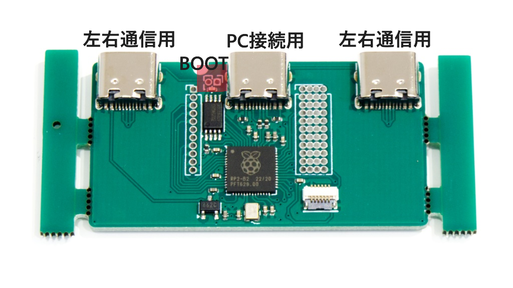

### 無線版コントローラ

|                      |                                                    |
| -------------------- | -------------------------------------------------- |
| マイコン             | nRF52840                                           |
| FLASHサイズ          | 1MB                                                |
| 対応ファームウェア   | [ZMK Firmware](https://github.com/zmkfirmware/zmk) |
| IO                   | 18(うち4点は拡張ポートと共用)                      |
| ブートローダ起動方法 | 電源スイッチをOFFにした状態でUSB接続               |
| 対応バッテリー       | Li-Poバッテリー(1S, 3.7V) *1            |
| バッテリーコネクタ   | PHコネクタ、2ピン                                  |
| 充電IC               | TP4057(4.2V, 200mA設定) *2              |
| 最大バッテリーサイズ | 6mm x 31mm x 52mm                                  |

*1 必ず保護回路がついたバッテリーを使用してください。  
*2 充電電流 200mA以上対応のバッテリー(0.5C充電の場合は容量400mAh以上)を使用してください。  

Li-Poバッテリーの使用上の注意をよく確認したうえで、適切に取り扱ってください。
本キットの使用に関するトラブルについて、当方では一切の責任を負いません。

## 必要な部品

| 部品                                     | 数                     | 備考                                                                                                      |
| ---------------------------------------- | ---------------------- | --------------------------------------------------------------------------------------------------------- |
| **有線構成**                             |
| コントローラボード                       | 1 or 2                 |                                                                                                           |
| コンスルー(11ピン, 1.27mmピッチ、H2.5mm) | 2 or 4                 |                                                                                                           |
| **無線構成**                             |
| コントローラボード                       | 1 or 2                 |                                                                                                           |
| バッテリー                               | 1 or 2                 | PHコネクタ(2mmピッチ)を使ってください。MicroBlade(1.25mmピッチ)のものを使う場合は変換ケーブルも必要です。 |
| コンスルー(9ピン, 1.27mmピッチ、H2.5mm)  | 2 or 4                 |                                                                                                           |
| **共通**                                 |
| スイッチ                                 | 適量                   |                                                                                                           |
| キーキャップ                             | 適量                   |                                                                                                           |
| USB Type-Cケーブル                       | 1 or 2(有線分割の場合) |  PCとキーボードを接続する用のType-Cケーブルと、有線分割の場合は左右接続用のC-to-Cケーブルが必要です。             |
| 滑り止め                                 | 適量                   |                                                                                                           |
| ソケット                                 | 適量                   | MX用またはChoc用                                                                                          |
| ダイオード                               | 適量                   | 1N4148Wなど                                                                                               |
| スタビライザ                             | 適量                   | PCBマウントのもの                                                                                         |

> [!tip]
> 1.27mmピッチのコンスルーは2.54mmピッチのコンスルーを加工することで作れます。

> [!caution]
> バッテリーの極性に注意してください。
> 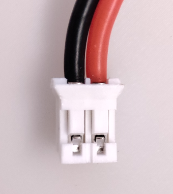

## 必要な工具

* ペンチ
* ピンセット
* はんだごて

## ツールの説明

- [基本設定](manual/BaseConfig.md)
- [マトリクスエディタ](manual/MatrixEditor.md)
- [モジュールエディタ](manual/ModuleEditor.md)
- [配置エディタ](manual/PlacementEditor.md)
- [基板エディタ](manual/PcbEditor.md)
- [ケースエディタ](manual/CaseEditor.md)

## チュートリアル

### Auto-KDKにアクセスする

[Auto-KDK](https://auto-kdk.pages.dev/)を開いてください。

推奨ブラウザ: Edge or Chrome (Firefoxでも動作は確認していますが、一部動作が遅いです)

### キーボードのタイプを選択する

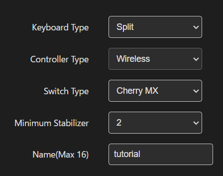

* Keyboard Type
  *  一体型か分割型か選択してください
* Controller Type
  * 有線コントローラか無線コントローラか選択してください
* Switch Type
  * MXかChocV2スイッチか選択してください。ChocV2の場合はキーピッチも変えられます
* Minimum Stabilizer(MXのみ)
  * スタビライザを付ける最小のスイッチ幅を選択してください。こだわりがない場合は`2`を選択してください。`None`を選択した場合はどんな幅のスイッチでもスタビライザを使用しない設計になります。
* Keyboard Name
  * キーボードの名前を16文字以内の英数字で入力してください

### キー配置を編集する

row, colの数値を変更して、マトリクスのサイズを選択します。
row, colの合計の上限は、有線コントローラでは22、無線コントローラでは18となっています。

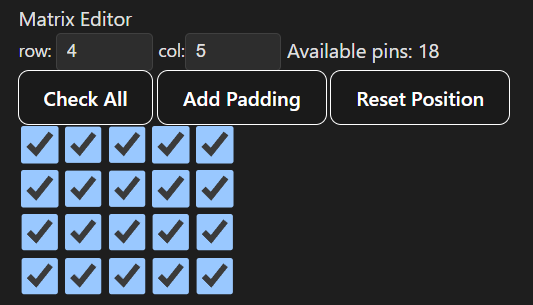 

`Placement Editor`で部品配置を指定できます。

スイッチをクリックすると1つのスイッチを選択できます。ドラッグすることで複数のスイッチを選択することもできます。

スイッチを選択してDeleteキーを押すことで、スイッチを削除できます。削除してしまったスイッチを再度配置したい場合は、`Matrix Editor`のチェックボックスから選択してください。

|  | 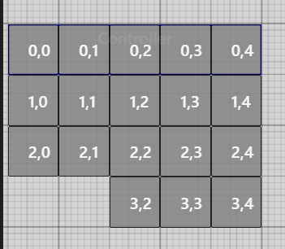 |
| ----------------------- | ----------------------- |

スイッチをクリックするかドラッグして複数のスイッチを選択した状態で方向キーを押すとスイッチが移動します。デフォルトの移動量は0.125U*1です。
ctrlを押しながら方向キーを押すと0.01Uずつ、shiftを押しながら方向キーを押すと1Uずつ動きます。

上にあるModule Editorからスイッチの角度や大きさを変えることもできます。

| 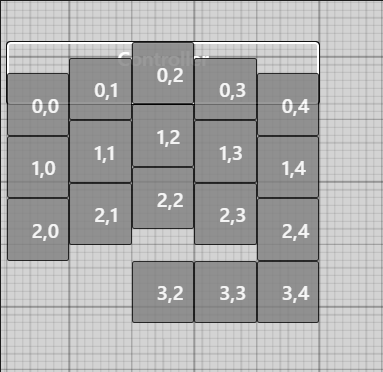 | 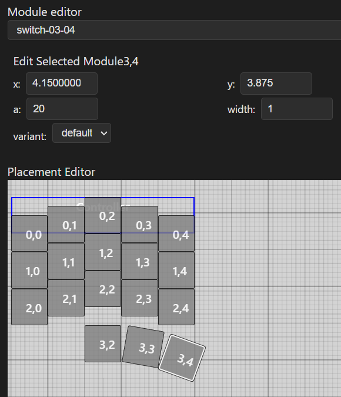 |
| --------------------- | ----------------------- |

親指だけロープロファイルのスイッチにしたい場合は`Module Editor`で`variant`を`Choc V2`にします。

| 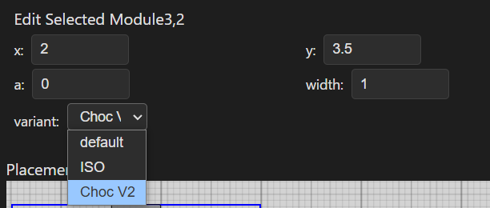 | 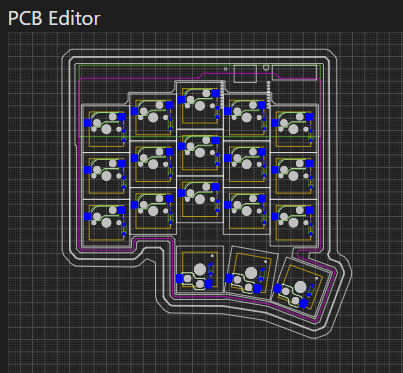 |
| --------------------------- | -------------------------- |

基板上での部品配置は`PCB Editor`で確認できます。コントローラ用のパッド(灰色の楕円)とキースイッチのパッド(青色の矩形)が干渉していないかチェックしてください。基本的に、コントローラ用のパッドが被さるスイッチ(今回の例だとswitch-00-03)とコントローラの`x`の値が一緒であれば干渉しないはずです。

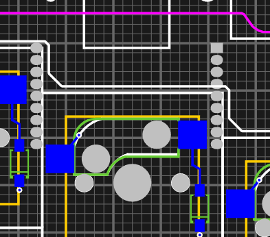

*1: 1Uの幅は、`Switch Type`での選択に依存します。MXの場合は1U=19mm, chocV2の場合は指定したキーピッチに相当します。

### ケースのパラメータを編集する

`Case Editor`のパラメータを変更することで、チルト角やテント角、ベゼルの太さを変更できます。

チルト角(`tilt angle`)の最小値は底面厚さ(`bottom thickness`)によって変わります。チルト角を小さくしたい場合は底面厚さを増やしてください。

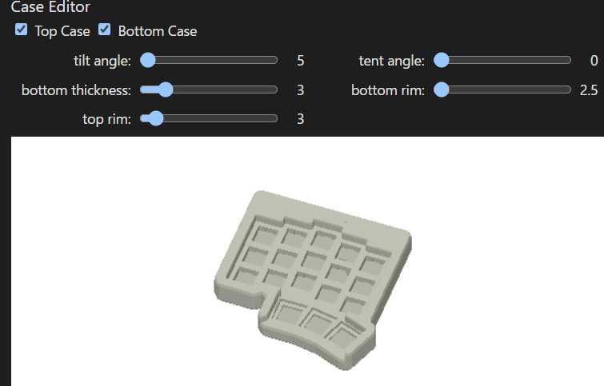

> [!tip]
> ケースの見た目を変えたい場合、`Matrix Editor`で`Add padding`ボタンをクリックし、`Placement Editor`に追加されたpadding要素のサイズや位置を変更してください。
>
> | 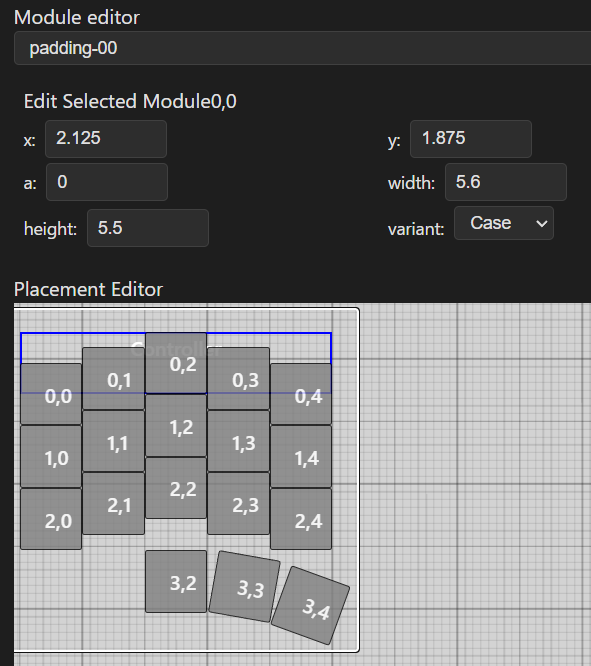 | 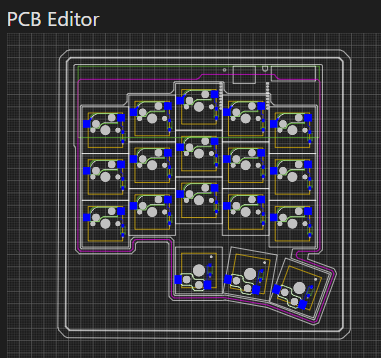 | 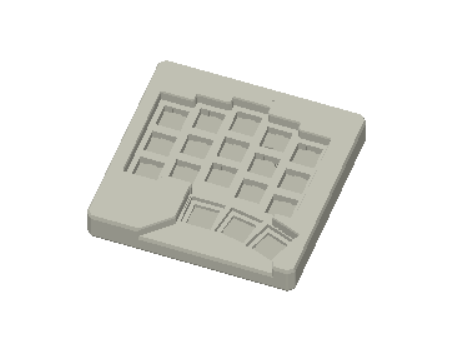 |
> | ------------------------ | ------------------------ | ------------------------- |

> [!tip]
> padding要素の`variant`を`PCB`にするとPCBの形状を変更できます。スイッチの間隔をあけて配置したために生じた穴やくびれを埋められます。

`mount type`をGasketにするとガスケットマウントのケース構成（トップ・スイッチプレート・ボトム）になります。
組み立てなどの詳細は[ガスケットマウント](manual/GasketMount.md)のページに記載しています。
このチュートリアルはインテグレーテッドマウント(デフォルト)を前提として進めます。

### (分割型の場合)

反対側のキーボードも同様に編集してください。

左右対称の場合は`Matrix Editor`の`Copy Position`ボタンをクリックすることで左手側からコピーできます。

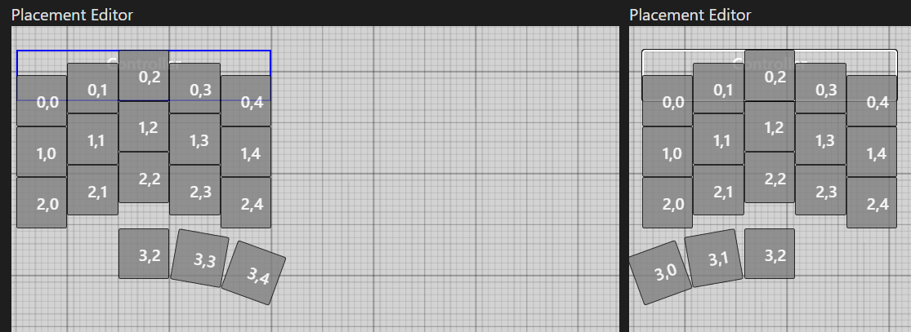

### 自動配線を実行する

`PCB Editor`の`Start Routing`ボタンをクリックすると自動的に基板が配線されます。

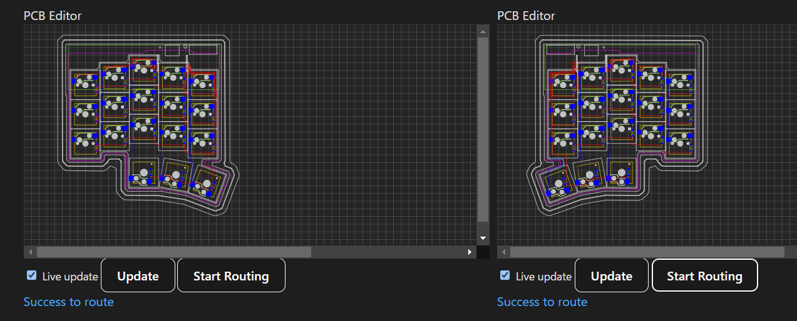

> [!tip]
> 配線に失敗してしまった場合は、コントローラの位置をずらすと成功する場合もあります。コントローラが中心に近いほうが成功率が高い傾向です。
> |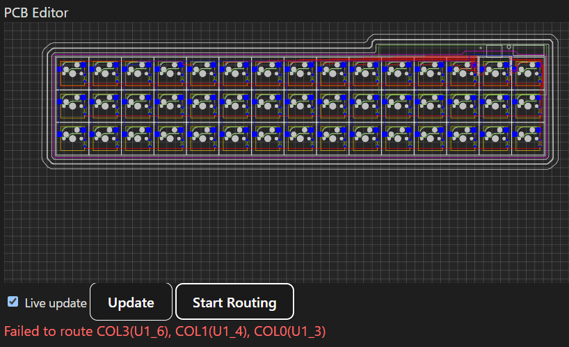|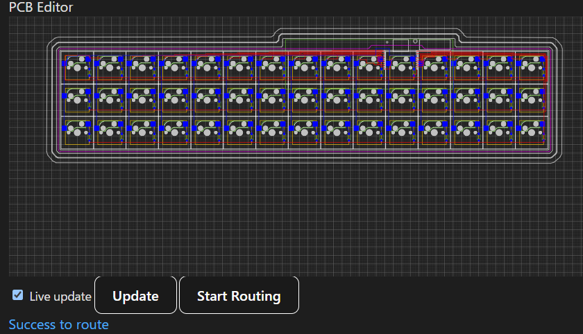|
> |-|-|
>
> それでもうまくいかない場合は、そのまま先に進んで一度ファイル出力して、EasyEDAに読み込んで手動で配線してください。

### ファイルを出力する

`Generate` ボタンをクリックし、利用規約に同意すると設計されたキーボードのデータがダウンロードできます。

ダウンロードしたzipファイルには以下のデータが含まれます。無線版と有線版でディレクトリ構成は異なります。
  - ケースSTLファイル (3Dプリント用)
  - 基板設計ファイル
  - ファームウェア設定
  - auto-kdkの設定ファイル

| 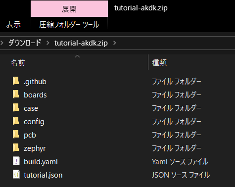 | 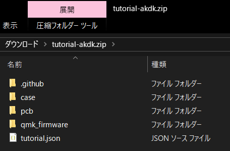 |
| ------------------------------ | ------------------------------ |

> [!tip]
> <キーボード名>.jsonファイルをAuto-KDKの`Import`ボタンから読み込むとキーボードを再編集できます。`Export`ボタンをクリックするとこのファイルだけ出力できます。

### EasyEDAにデータを保存する

[EasyEDA](https://easyeda.com/editor)にアクセスし、ログインします。アカウントがない場合は`Registre`をクリックしてアカウントを作成してください。

EasyEDAにはProとStd版がありますが、ここではStd版を使用します。画面の見た目は違いますがPro版でも似た手順です。

Auto-KDKが出力したzipファイルをEasyEDAで開くと基板データがロードされます。
分割型キーボードを設計した場合は3種の基板が読み込まれます。

| 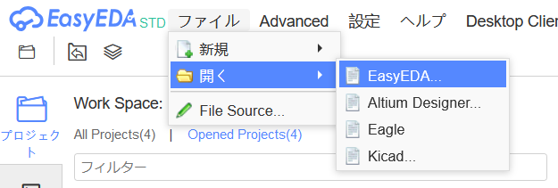 | 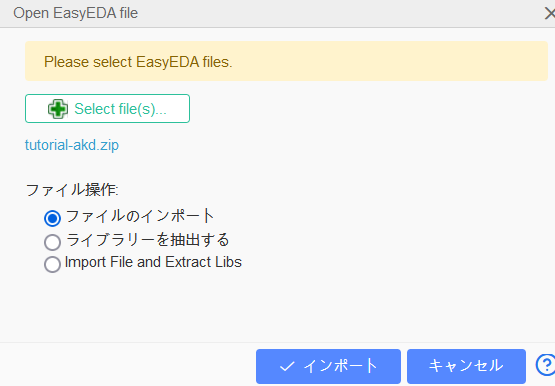 | 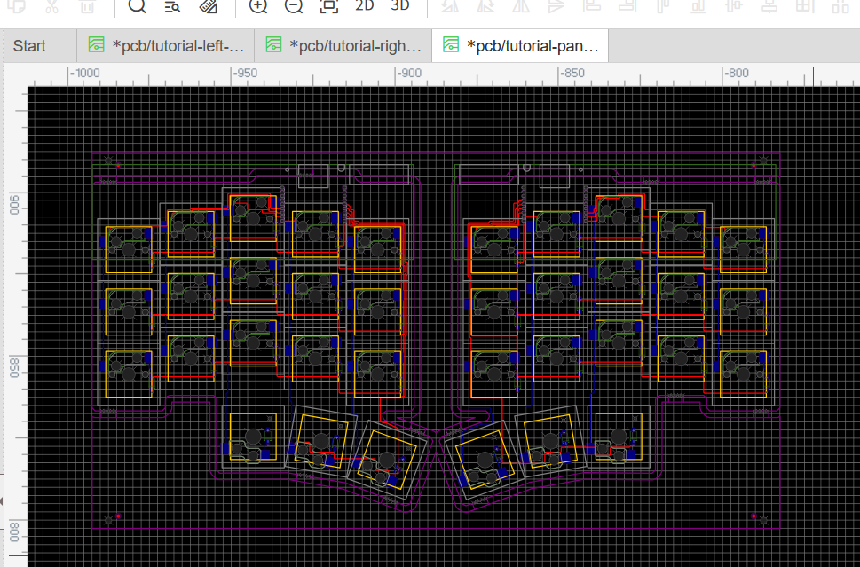 |
| -------------------------- | ------------------------ | ----------------------- |

`デザインマネージャー`を開き、`DRC Errors (x)`の横にある`↻`をクリックするとDRC(Design Rule Check)が始まります。
DRCが完了しても`DRC Errors`の数値が0のままならOKです。異常が表示される場合はEasyEDA上で修正するか、Auto-KDKに戻って配置を変更してください。

 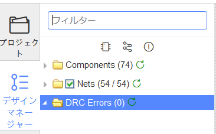 

`Tool->TearDrop`を選択して配線にティアドロップを付けます。設定はデフォルトのままでOKです。

| 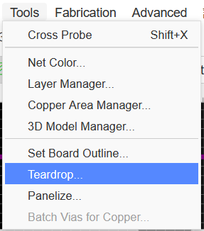 | 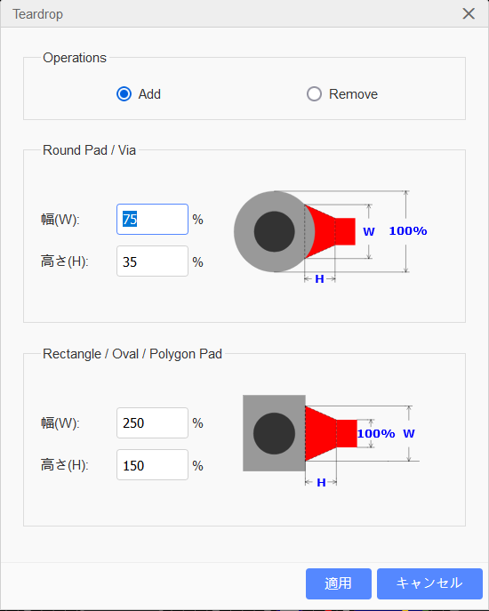 | 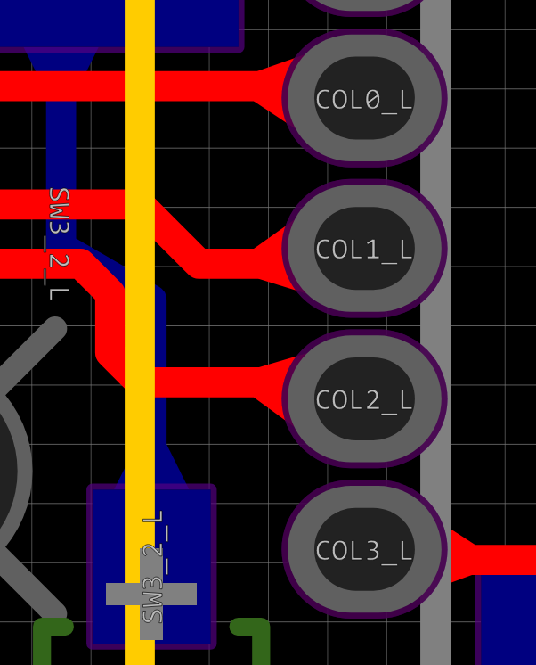 |
| -------------------------- | ---------------------------- | ---------------------------- |

`File->Save`を選択してEasyEDAにデータを保存します。

他の基板も同様に、DRCとティアドロップを実行してから保存してください。

| 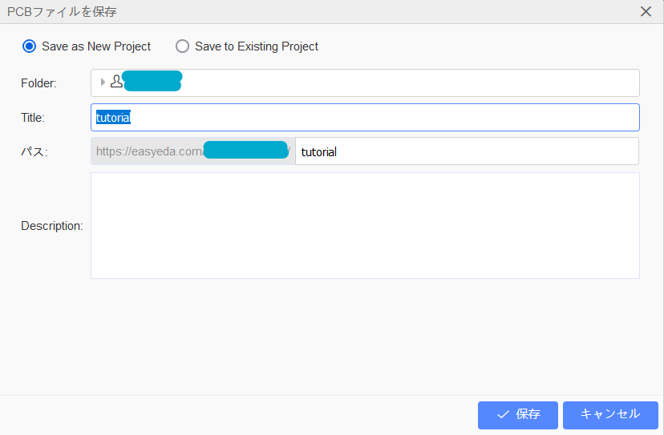 | 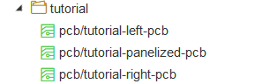 |
| ---------------------- | ------------------------- |

### JLCPCBに発注する

EasyEDAはJLCPCBと連携しており、そのまま基板を発注できます。

別のタブで[JLCPCB](https://jlcpcb.com/)にログインしておきます。

EasyEDAで発注したい基板を開き、`Fabrication -> One-click order PCB/SMT`を選択します。
分割キーボードを設計した場合は、左右の基板を別々に頼むためのデータと面付(panelize)した状態で頼むためのデータがあります。
基板のサイズによりますが、面付した状態のほうが安上りのことが多いです。

DRCを再度実行するか確認されるので、`yes`を選択してください。

面付した基板を発注する場合でも、EasyEDAの確認画面では片側しか表示されないことがあります。問題ないので`One-click Order PCB/SMT`を押してください。

| 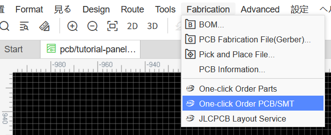 | 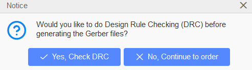 | 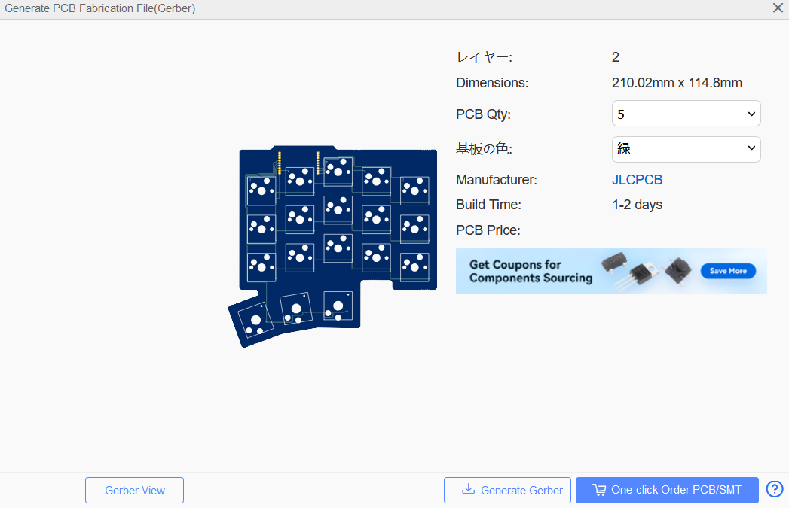 |
| ---------------------- | ---------------------- | ---------------------------------- |

出力が完了すると自動的にJLCPCBに遷移し基板データがロードされます。うまくロードされない場合、JLCPCBへのログインが完了してからEasyEDAから出力しているか再確認してください。また、以降の操作でブラウザバックやリロードするとEasyEDAのデータがうまく読み込まれないことがあるので、その場合はEasyEDAから操作をやり直してください。

面付したデータを注文する場合は外形が正確に表示されませんが、問題ありません。

パラメータは基本的にデフォルトでOKです。ただし、面付の場合はDifferent Designを2にします。

|  | 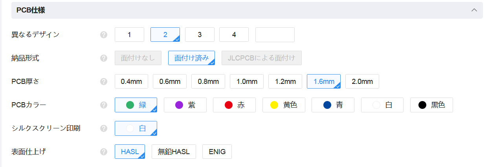 |
| ----------------------- | ---------------------------- |

PCBAせずに基板だけ発注する場合はJLC3DPで製造するケースと一緒に発送してもらえるため、カートに入れて次のステップに進んでください。
左右別々の基板を発注する場合はもう一方の基板も同様にEasyEDAから出力してください。

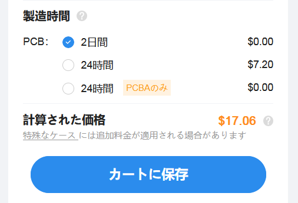

JLCPCBではダイオードとMXソケットを実装(PCBA)した状態まで製造してもらうこともできます。Choc用ソケットも実装してもらうにはあらかじめJLCPCBに部品を送付する必要があります。

PCBAする場合はPCB Assemblyを有効にし、`Bottom side`を選択します。

デフォルトでは5枚組み立てる設定になっています。最小枚数は2です。

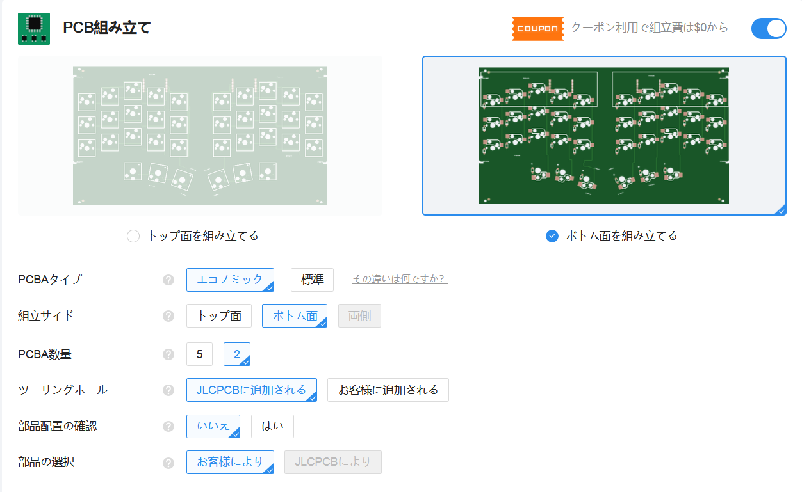

> [!tip]
> Auto-KDKのデータは商用利用も可能なので、余った基板をBOOTH等で販売しても構いません。PCBAの価格は5枚でも2枚でも変わらないので、販売する前提なら5
> 枚頼んでもいいかもしれません。

オプションの選択が完了したら`次へ`をクリックします。

| 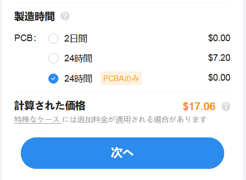 | 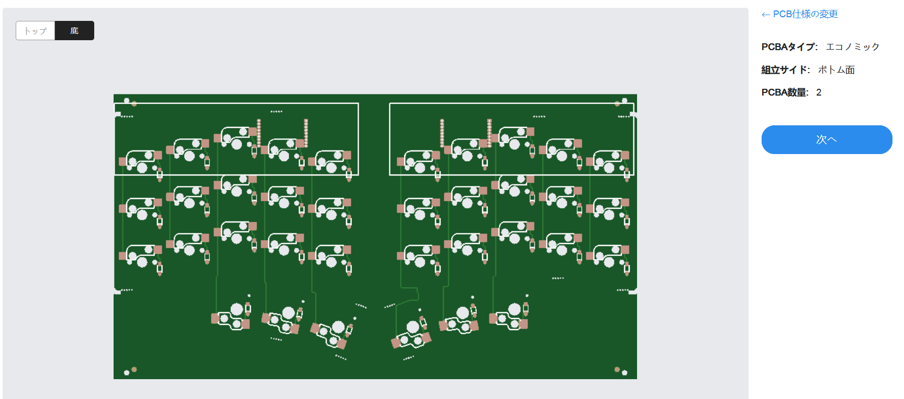 |
| ----------------------------- | ---------------------------- |

BOM/CPLのロード画面ではU1が見つからないという警告が出ますが、`次へ`を押してそのまま進みます。

今回の例ではMXスイッチとChocV2スイッチを混在させたため、MXスイッチとダイオードのみハンダ付けしてもらいます。
タイミングによってはMXスイッチ用のソケットの在庫がないこともあります。

一部の部品が選択されていないと表示されますが、`配置しない`を選択してください。

| 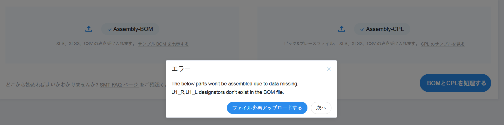 | 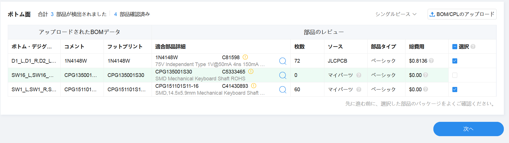 | 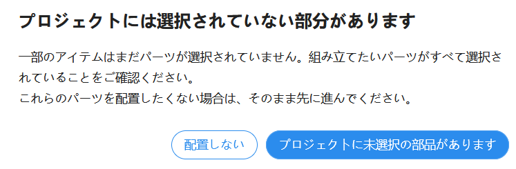 |
| ---------------------- | ---------------------- | -------------------------- |

配置確認画面で基板の裏面に部品が配置されていることを確認します。

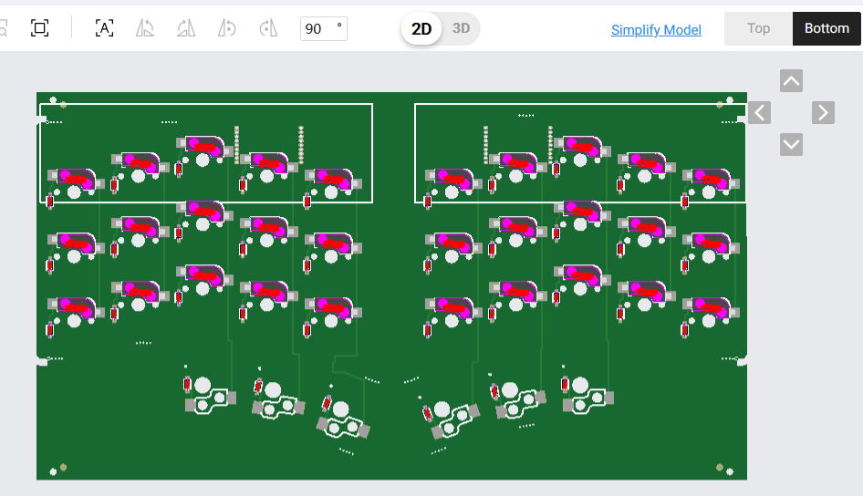

商品説明では`キーボード`を選択してください。

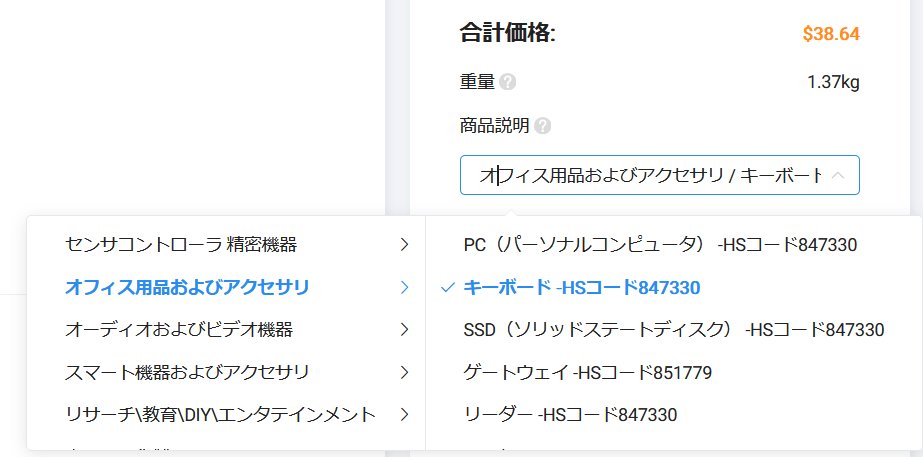

PCBAする場合はケースと別の発注になるため、カートに保存して支払いに進んでください。

### JLC3DPに発注する

[JLC3DP](https://jlc3dp.com/jp/3d-printing-quote)にアクセスします。

Auto-KDKが出力したzipファイルの中にある`case`フォルダの中にあるstlファイルをJLC3DPにアップロードします。

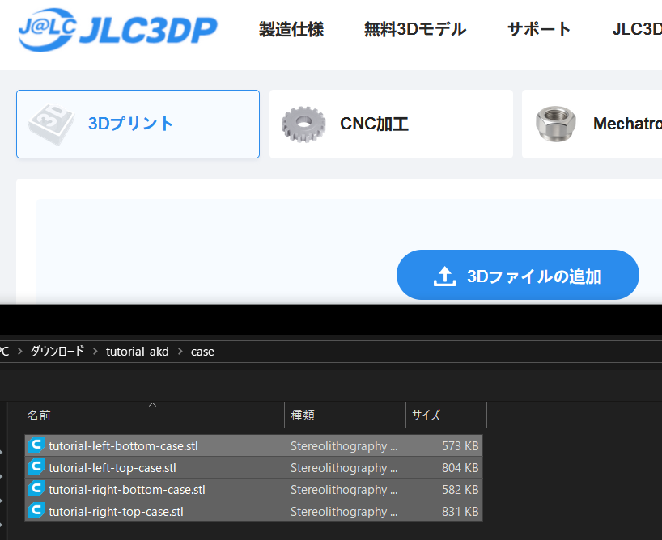

読み込んだすべてのファイルについて、商品概要は`オフィス機器とアクセサリ`から`プラスチックキーボードエンクロージャ`を選択します。

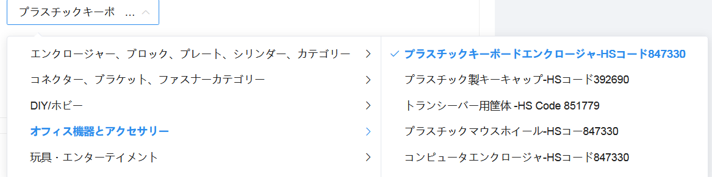

> [!important]
> 製造時の研磨工程で、誤ってボトムケースの突起を削り取られてしまう事象が確認されています。
> 3D remarkのところで研磨しすぎないように念押ししたほうが良さそうです。
> 削り取られてしまった場合、Quality compliantを提出して返金交渉しましょう。
>
> (2025/4更新) 削られないように突起のサイズを大きくしました。その代わりトップケースに入れにくくなってしまったので、
> 大きすぎて入らない場合はヤスリや爪切りで小さくしてください。
>
> 
> 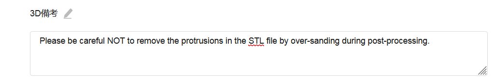

カートに保存し、注文手続きを進めます。基板注文時にPCBAオプションを付けていない場合、ケースとまとめて注文できます。

発注履歴にケースが表示されるようになった状態で数分経ってからタブをリロードすると、ファイル名の横に!マークが表示されることがあります。

!マークをクリックし、`はい`を選択してください。

|  |  |
| ------------------------ | -------------------------- |

JLC3DPによるレビュー中にメールで問い合わせが来る場合があります。
コンスルーのピンを避けるための穴の部分は貫通してしまっても問題ないので、そのまま製造してください。
面取りのパラメータを調整したことで壁が薄くなってしまっていた場合はパラメータを再調整してください。

### （オプション）フォームの発注

`foam/`フォルダに遊舎工房のフォームカットサービス用のsvgファイルが出力されます。遊舎工房のレーザー加工サービスで2mmのフォームをカットしてもらえます。
依頼時には、出力されたsvgファイルのサイズに合わせて材料のサイズを選択してください。
画像の例だと500x200サイズが必要です。

一部のパスが近接したデータが出力されてしまうことがあるので、依頼時のメールに「パーツの変形について理解している」との文面を記載してください。

フォームデータにはボトムフォーム（PCBとボトムケースの間に挟むフォーム）とガスケットマウント用フォーム（カット可能な最小サイズの都合で複数個連結しています）のデータが含まれています。

||
|-|

### ファームウェアをビルドする

Auto-KDKが出力したzipファイルを展開し、中身をGitHubにプッシュします。リポジトリ名は適当に決めてください。

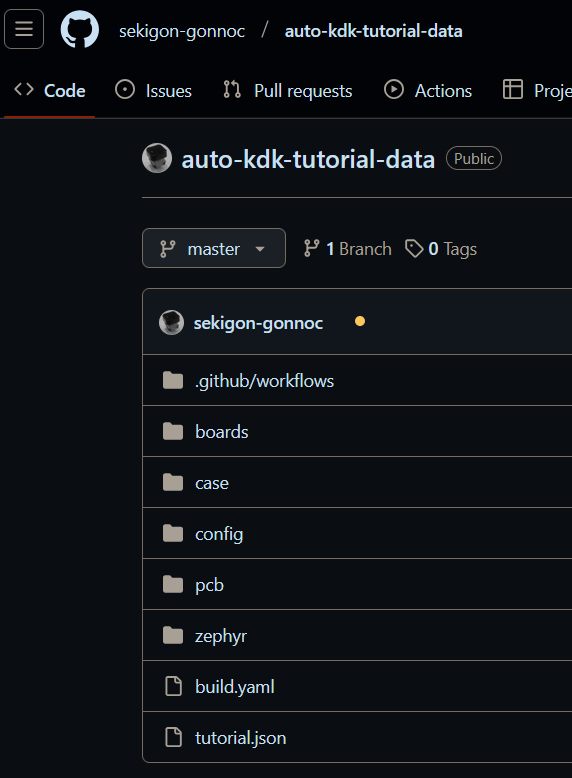

ファイルをプッシュするとGitHub Actionsによるビルドが始まります。
[Git初心者向け手順](to-github-beginner.md)

ビルドが完了したらファームウェアをダウンロードします。

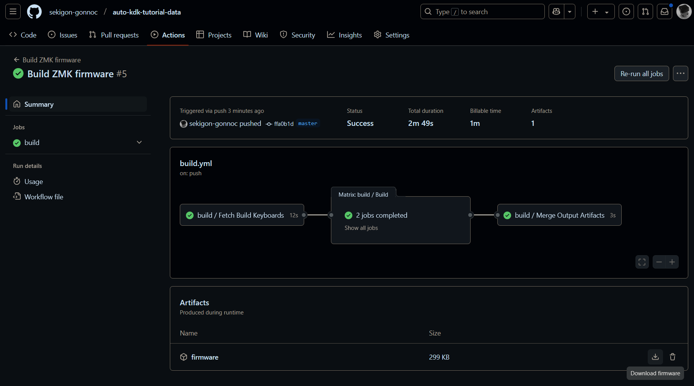

ダウンロードしたファームウェア(uf2ファイル)をコントローラボードに書き込みます。

初期状態のコントローラボードにUSBケーブルを接続するとUF2ブートローダが起動し、マスストレージとして認識されます。
認識されたストレージにダウンロードしたUF2ファイルをコピーします。 左手用と右手用を取り違えないようにしてください。

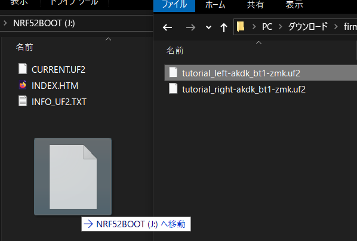

書き込み時にエラーが表示されたとしても書き込みが成功する場合があります。ストレージがアンマウントされていれば成功しています。

すでにファームウェアが書き込まれたコントローラボードからUF2ブートローダを起動する方法は[コントローラ](#auto-kdkコントローラ)の項目を確認してください。

### 組み立てる

基板にソケットとダイオードをハンダ付けします。

コントローラボードの取り付け穴付近でハンダ付けするときは、穴にハンダが流れ込まないようにマスキングしてください。

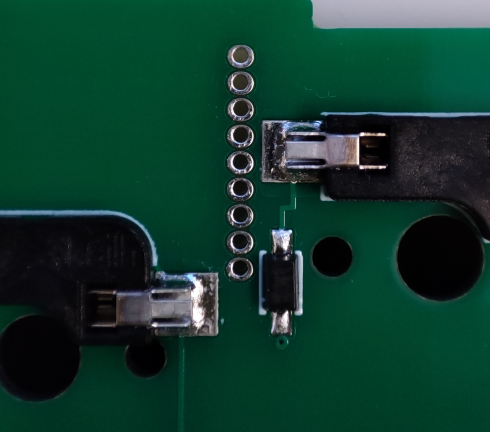

トップケースを間に挟むようにしながら、スイッチを基板に取り付けていきます。

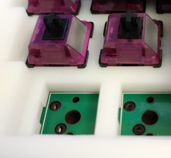

1.27mmピッチのコンスルーがない場合、2.54mmピッチのコンスルーのピンを差し替えて1.27mmピッチに変更します。

| 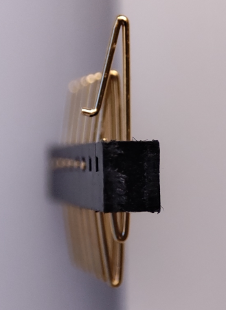 | 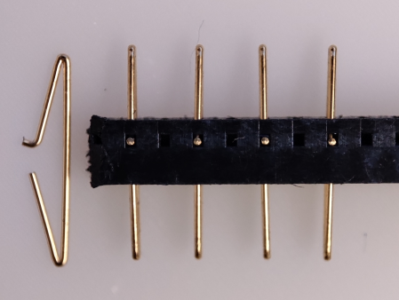 | 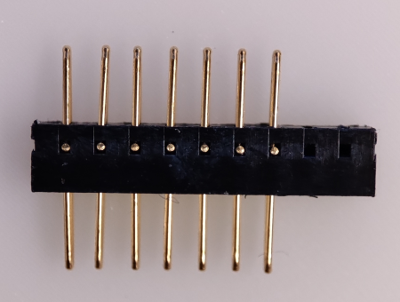 |
| ----------------------------- | ----------------------------------- | ----------------------- |

(無線版コントローラの場合)バッテリーをコネクタに差し込みます。バッテリーがケースの中で暴れないように不燃性のビニールテープなどで軽く固定することをおすすめします。

> [!caution]
> バッテリーの極性に注意してください。
> 
> 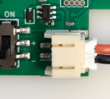

コントローラボードに付いているレールを、ペンチなどを使って折り取ります。

|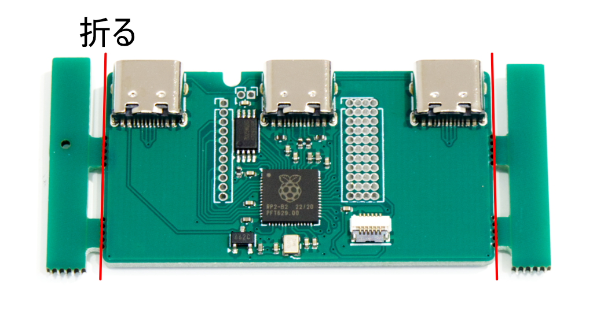|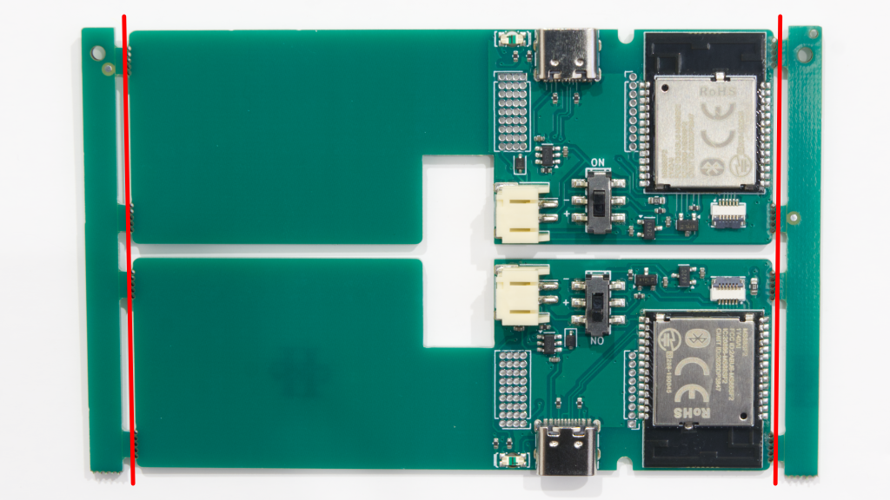|
|-|-|

コンスルーを使ってコントローラボードを基板に取り付けます。

コンスルーの小窓がスイッチ側に寄る向きで差し込みます。また、小窓の向きは2つのコンスルーで揃えてください。

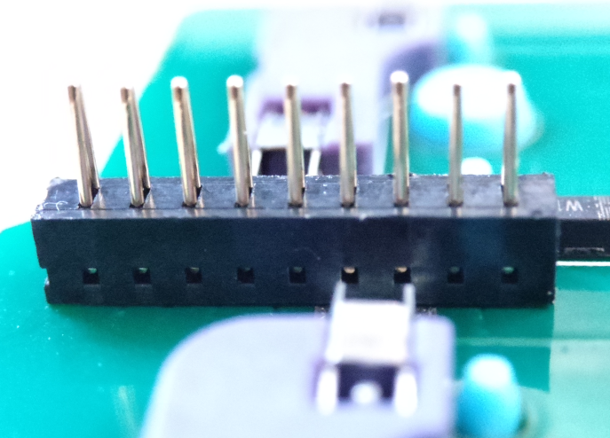

キーピッチ19mmの場合はコントローラの外側の穴を使います。キーピッチが1mm狭まるごとに穴を1つ内側にずらしてください。

|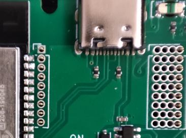|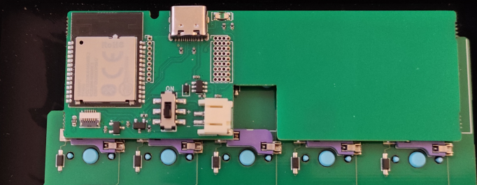|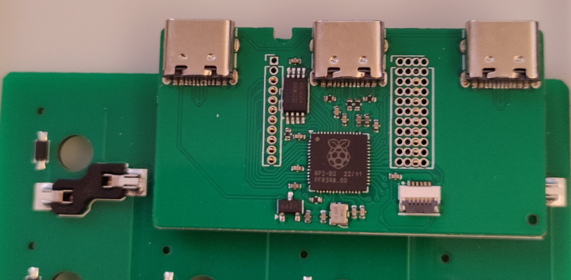|
|-|-|-|

ボトムケースを取り付けます。ボトムケースの爪をトップケースの窪みに押しあてながら押し込んでください。

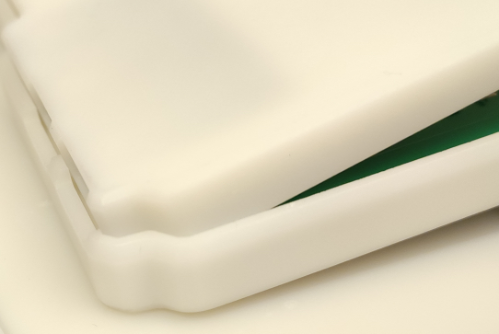

キーキャップをスイッチに差し込み、滑り止めをボトムケースに貼り付けたら組立完了です。

### キーマップを変更する

初期状態ではキーマップは空になっています。
有線版コントローラでは[vial](https://vial.rocks)を、無線版コントローラでは[ZMK Studio](https://zmk.studio/)を使ってキーマップを設定できます。

分割・無線構成では左手側がCentralとなっているため、左手側をUSBケーブルで接続して設定してください。

初期状態のキーマップを変更したい場合は、ソースコードに記入してファームウェアをビルドする必要があります。
ソースコードを直接編集するほか、有線版コントローラでは[vial-keymap-c-editor](https://vial-keymap-c-editor.pages.dev/)、無線版コントローラでは[keymap-editor](https://nickcoutsos.github.io/keymap-editor/)を使ってソースコードを編集することもできます。

## サポートについて

* ファームウェアについてのサポートは提供しません。各ファームウェアのドキュメントを参照してください。
* 製造上のトラブルや組立に関するトラブルもサポートできません。
  * JLCPCBからのメールを転送してなんと答えればいいか聞かれても回答いたしかねます。
* ツールに関する要望や問い合わせは本リポジトリのissueに投稿してください。
  * ツールの出力に関する質問の際には、exportボタンで出力したjsonファイルか、出力一式をアップロードしたリポジトリの場所を添付してください 

## その他

### 推奨タグ

* sns投稿: `#auto_kdk`
* GitHubのリポジトリのtopics: [`auto-kdk`](https://github.com/topics/auto-kdk)
