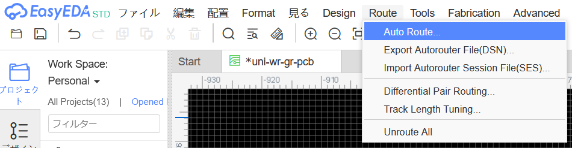
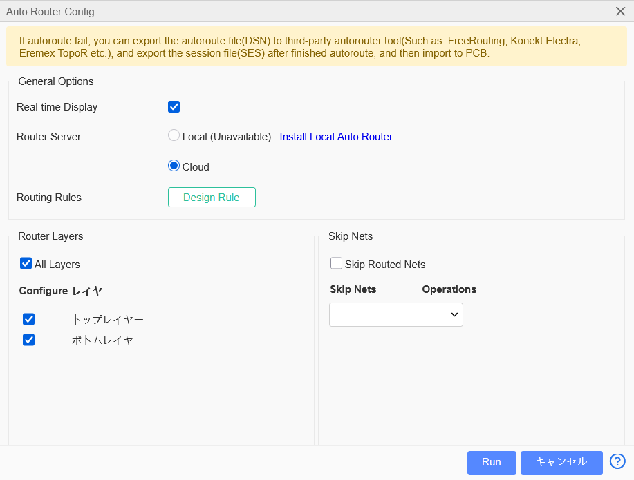

# EasyEDAのオートルータ

EasyEDAのメニュー画面から`Route->Auto Route...`をクリックし、下記の設定で`Run`ボタンをクリックすると自動で配線できます。

`Run`を押した直後に`Checking local auto router server...`というエラーメッセージが出る場合には、`OK`をクリックしてからもう1回`Run`ボタンをクリックしてください。

||
|-|
||