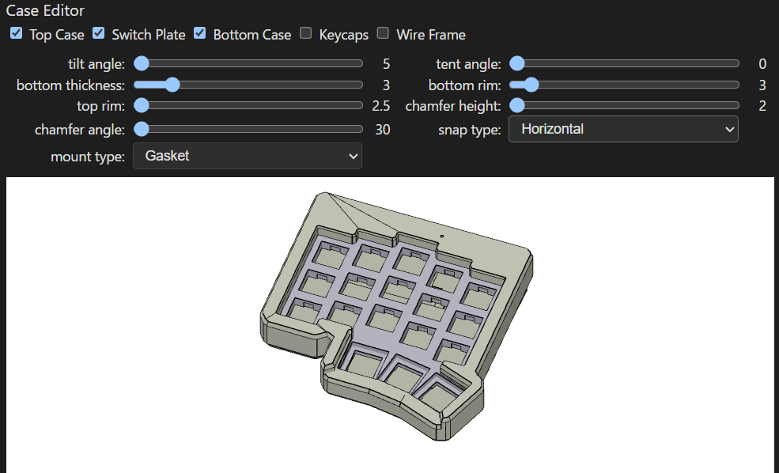
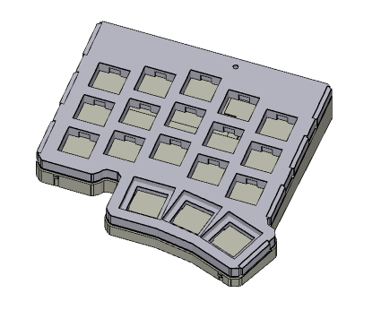
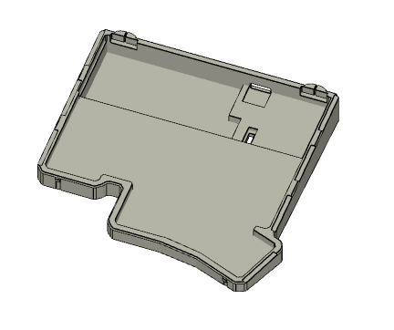
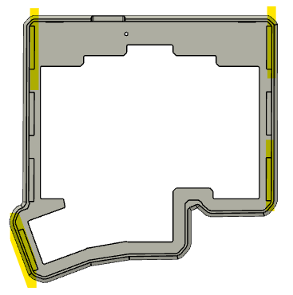
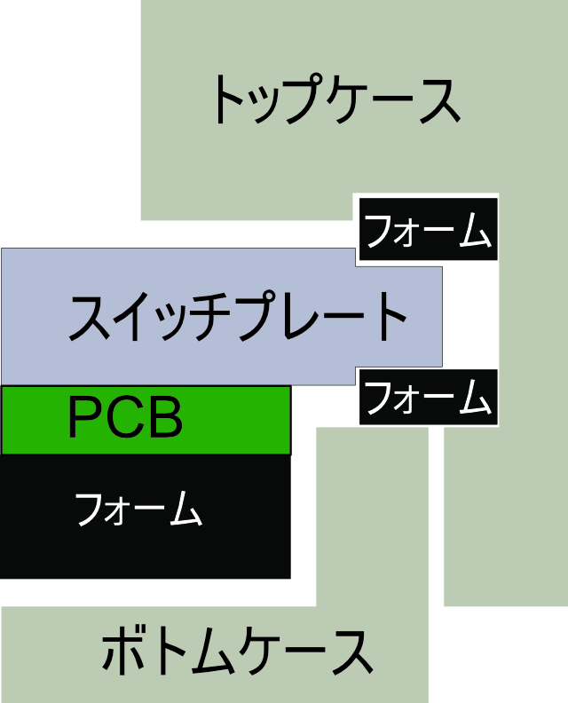
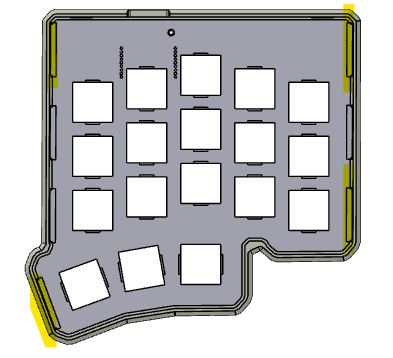
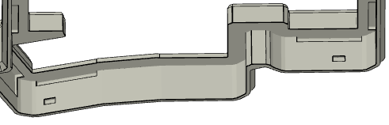
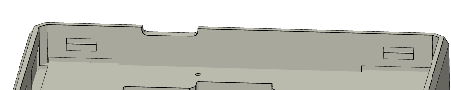

# ガスケットマウント

## マウントタイプの選択

Case Editorの`mount type`を`Gasket`にするとガスケットマウント用のデータが生成されます。ケースが3ピース構成になります。

基板のデータは変わりません。

|||
|-|-|-|

## データの生成

パラメータ調整やデータの生成方法は通常通りです。ガスケットマウントの場合は`bottom rim`の最小値は3mmになります。

## フォームの発注

ガスケットマウント構成ではフォームの発注が必須となっています。

## 組み立て

使用するマウント用フォームの数を変えることで硬さを調整できます。ここでは、最小構成の上下4個ずつで説明します。

ボトムフォームが完全に切り離されていない（赤線の部分が繋がっている）場合、指で軽く引っ張って切り離します。

ボトムフォームをPCBの裏側に乗せてからコントローラを差し込みます。

PCBの表側にスイッチプレートを置いて、その上からスイッチを差し込んでいきます。

連結されたマウント用フォーム（3x19mmの長方形）を切り離しながら、ひっくり返したトップケースの四隅に押し込みます。

|||
|-|-|

スイッチプレートとPCBをトップケースに入れます。

マウント用フォームをスイッチプレートとトッププレートのくぼみに押し込みます。

||
|-|

ボトムケースをはめ込んだら完成です。

設計上は0.5mmくらいスイッチプレートが押し込めるようになっています。キーボードのサイズが大きくて自重で沈み込んでしまっている場合は、フォームの数を増やしたり、PCBの下にも配置したりしてみてください。

## 補足

スイッチプレートが前後に動いてしまう場合、トップケースの前後に空いている溝にマウント用フォームを入れることで動作を規制できます。フォームが幅広すぎて隙間に入り切らない場合は細く切ってください。

||
|-|-|