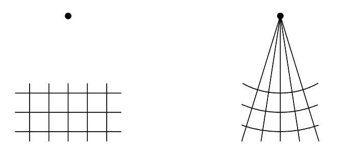
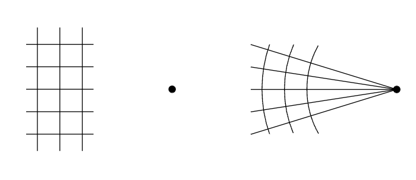
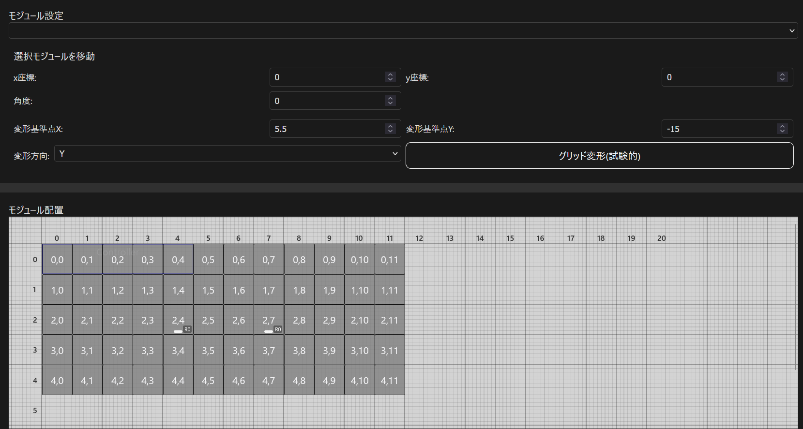
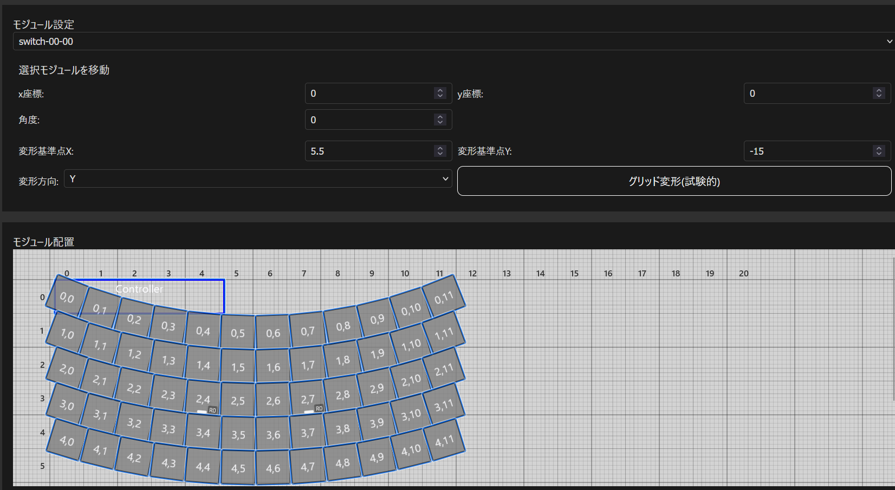
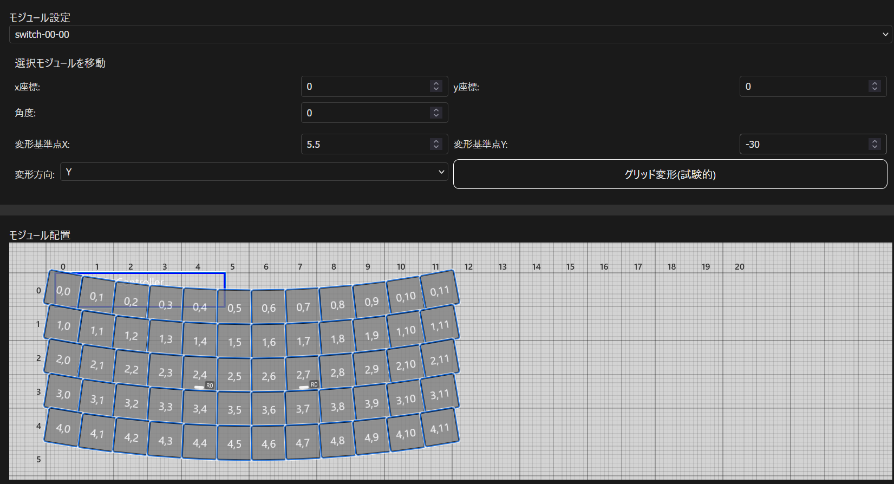

# グリッド変形機能

グリッド変形機能を使用すると曲線に沿った配列を簡単に作成できます。

グリッド変形機能では、下記に示す概念図のように、基準点を中心とした同心円状にキーを配置します。

<video controls src="https://github.com/user-attachments/assets/fb9055c4-2398-4c2f-a6c4-4b6404450f52"></video>

|||
|-|-|
|Y方向に変形|X方向に変形|

## 使い方

* `モジュール配置`パネルのキーを選択していない状態で、変形基準点と方向を入力します
* 配置を変更したいキーをまとめて選択します
* `グリッド変形ボタン`をクリックします
* キーの選択を解除する前なら、変形基準点を変更することでキーの配置を調整できます
* キーの選択を解除してしまった後に調整したい場合は、`Ctrl+Z`で編集を取り消して最初の手順に戻ってください

|||
|-|-|
|中央に対して対称に変形したいので、基準Xを5.5にします|変形したいスイッチをすべて選択します|
|||
|曲線をなだらかにしたいので、基準Yをキーから離れた位置にします(-20→-30)||
