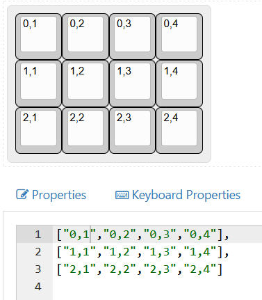
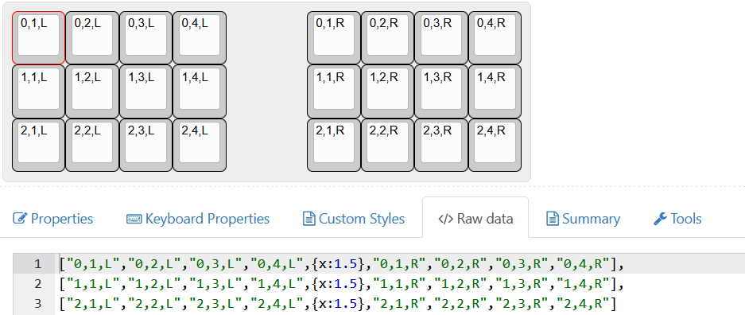

# KLEのデータをインポートする

Keyboard-Layout-Editorで作成したレイアウトをインポートすることもできます。

ラベルでrow,colを指定してKLEから出力したjsonファイルを、Auto-KDKのimportボタンで読み込めます。
分割型の場合はcolのあとにL,Rで左右を指定してください。

|  |  |
| ------------------------ | ---------------------- |