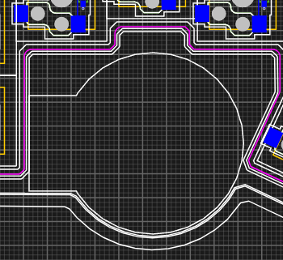
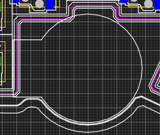
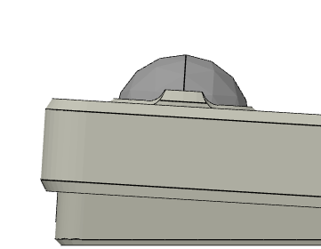
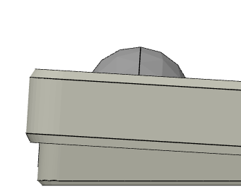
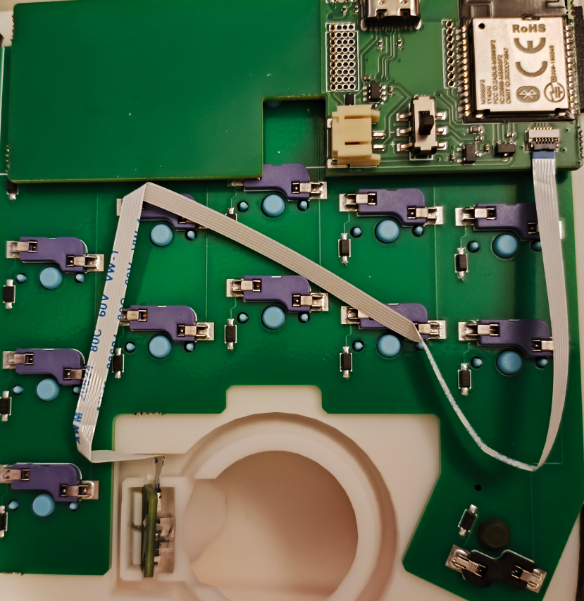

# トラックボール

親指操作用の34mm/25mmトラックボールや人差し指操作用の25/34/40/50mmトラックボールを配置できます。 [サンプル](../sample/34key-split-col-staggerd-dual-trackball.json)

## 追加で必要な部品

下記は片手分です。両側にトラックボールを配置する場合は2セット必要です。

|部品|数|備考|
|-|-|-|
|トラックボール(指定したサイズ)|1|40mm/50mmはPOM球などを購入してください|
|2mmセラミックボール|3|支持球用|
|14mmマウスセンサーモジュール|1|https://nogikes.booth.pm/items/6520217|
|FFCケーブル(0.5mmピッチ, 6ピン, 同一面)|1|長さはトラックボールからコントローラまでのマンハッタン距離+50mm くらいあれば十分だと思います。|

## 組み立てに必要な道具

|名前|使い道|
|-|-|
|木工用ボンド|支持球の固定|
|マスキングテープ|支持球を接着するときの養生、センサー取付部の調整|
|爪楊枝|木工用ボンドを塗る|

## トラックボールの有効化

`マトリクス構成`で拡張モジュールから`トラックボール`を選択するとトラックボールが配置されます。
無線版コントローラではトラックボールを配置すると使用可能なピン数が14本に減ります。

## レイアウトの指定

`モジュール設定`, `モジュール配置`でボールの位置、角度、バリエーション（指、サイズ）を指定します。
`PCBエディタ`でみたときにトラックボールを示す枠線が他の枠線と交差しないようにしてください。

|||
|-|-|
|OK|NG|

### 人差し指トラボの注意点

25mm人差し指トラボ・MXスイッチの場合、横から見たときにボール抑えがケースに埋まってしまうことがあります。
完全に埋まってしまうとボールのつけ外しが困難なので、Zオフセットを調整するか、組み立て時にやすり掛けしてつけ外しできるように調整してください。

|||
|-|-|
|OK|NG|

## データの出力

データを出力するとトラックボールが配置されたケースデータとファームウェアが出力されます。
ファームウェアはトラックボールを使用するための最低限の設定しか書いていないので、必要に応じて編集してください。

## 組み立て

### キースイッチの取り付け

* まずは通常の組み立て手順にしたがい、キー入力が可能になるところまで組み立ててください。
* 無線版コントローラの場合はバッテリーの取り付けは不要です。組み立て中にショートさせたりする危険があるので、必ず外してください。
* 動作確認の手順までUSBケーブルも外してください。

### ボール抑えの調整

3Dプリントの誤差によりボールが入れられなかったり抜けやすい場合には、やすり掛けやマスキングテープで微調整してください。

### 支持球の固定
  
* 爪楊枝の先端に木工用ボンドを少しだけとり、取り付け位置に少量塗ります。
* マスキングテープに支持球を貼り付け、そのまま取り付け位置に貼り付けます。
* 木工用ボンドが乾いたらマスキングテープを外します。

### ボトムケースを外す

* 組み立てるためにボトムケースを外してください。

### センサーの動作確認

* センサーとコントローラをFFCケーブルで接続します。
* コントローラにUSBケーブルを差し込み、センサーを机の上で動かして動作確認します。
* 動作確認が終わったらUSBケーブルを外してください。

### センサーの固定・調整

#### 親指トラボの場合

* FFCケーブルを折り曲げながらセンサーを固定部に挿入します。
  * 固定部の隙間が広すぎる場合はマスキングテープなどで狭めてください。

#### 人差し指トラボの場合

* マスキングテープを使ってセンサーを取り付け部に仮止めします。
* 動作確認が済んで位置が確定したら、少量の木工用ボンドで接着してください。

### 動作確認

* トラックボールを押し込み、USBケーブルを差し込んで動作確認します。
* うまく動かない場合はセンサーの位置を調整してください。

### ボトムケースを取り付ける

* 無事に動いたらケースを閉じてください
