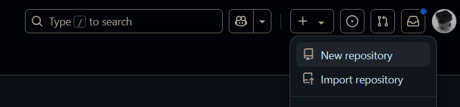
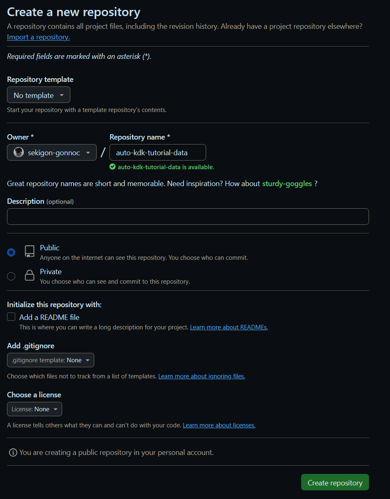
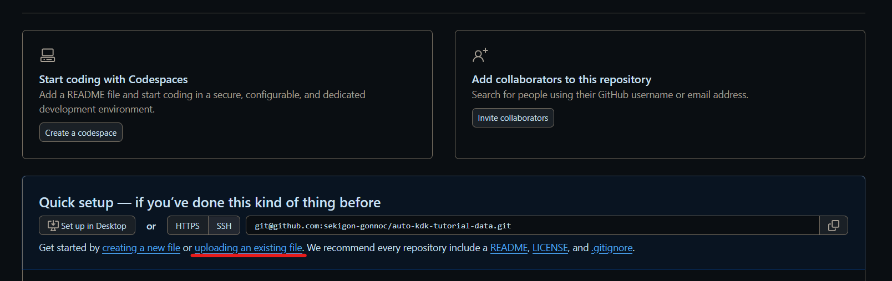
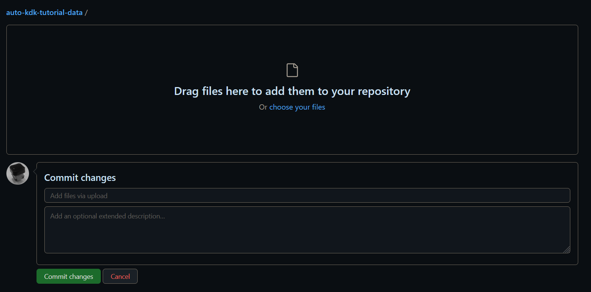
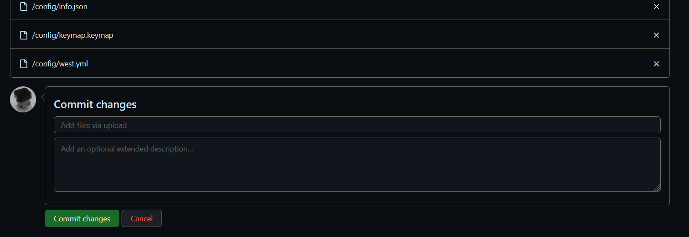
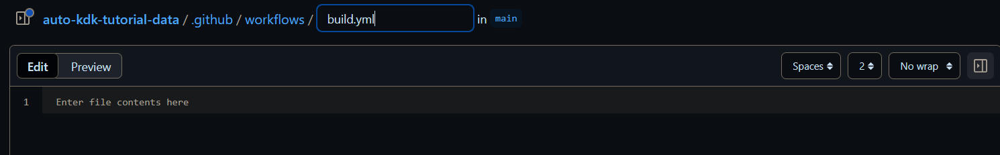

# GitHub初心者向け

gitやGitHubの使い方が分からない人向けの、ブラウザからファイルを追加する手順です。

## リポジトリの作成

`+`ボタンを押して`New repository`をクリックします。

リポジトリの名前を決めたら`Create repository`ボタンを押します。

## ファイルをアップロードする

`uploading an existing file`をクリックします。

アップロードするファイルをドラッグ＆ドロップします。

すべてのファイルのアップロードが完了したら、`Commit changes`ボタンをクリックします。

`.github/`以下のフォルダはこの方法ではアップロードできないため、`Add file`->`Create new file`を押して追加します。

フォルダ名とファイル名を順次入力し、ファイルの中身を張り付けます。

## ファイルを更新したいときは

`Add file`->`Upload files`をクリックして、同様にファイルをアップロードしてください。